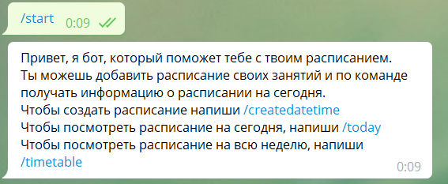
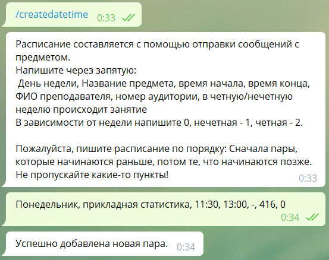
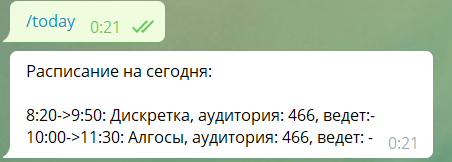
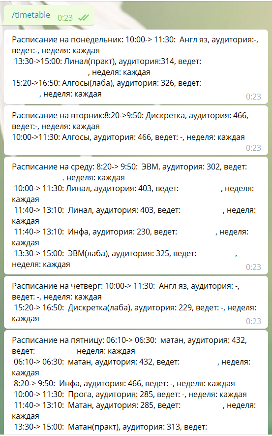

Бот-расписание для телеграма.

Работа с API идет через библиотеку telebot, в качестве хранилища данных используется Mysql.

**Исходный код:** [Тык](https://github.com/aogavrilov/My-some-projects/blob/master/Telegram%20timetable%20bot/main.py)

**Небольшая инструкция-описание:**

При нажатии стартовой кнопки "/start" появляется подсказка по использованию бота.

Давайте сначала добавим новую пару. 

После того, как добавили все нужные пары, мы можем посмотреть расписание на сегодня:

Также можно глянуть и полное расписание на неделю:

Полностью на работу бота можно глянуть по ссылке: @asg_timetablebot (если я не уберу бота с вдс, конечно). 

